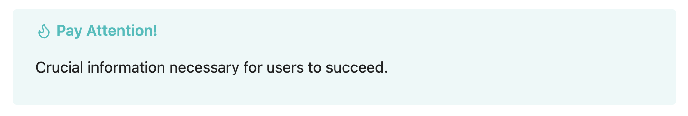
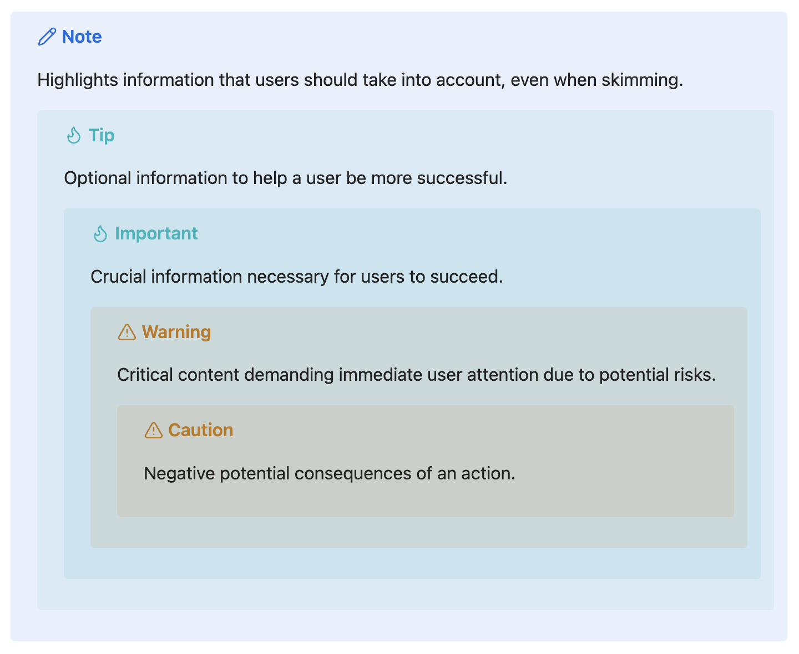

# Examples of using Alerts, Admonitions, or Callouts

## Alert Examples

The examples below should work in GitHub, Visual Studio Code, and Obsidian.

### Note

> [!NOTE]  
> Highlights information that users should take into account, even when skimming.

### Tip

> [!TIP]
> Optional information to help a user be more successful.

### Important

> [!IMPORTANT]  
> Crucial information necessary for users to succeed.

### Warning

> [!WARNING]  
> Critical content demanding immediate user attention due to potential risks.

### Caution

> [!CAUTION]
> Negative potential consequences of an action.

### Embedded Code-block

> [!TIP]
> Some useful Javascript:
>
> ```js
> function foo() {
>   return 'bar';  
> }
> ```

## Syntax Incompatible With GitHub

### Callout With Custom Title

Obsidian and Visual Studio Code supports rendering callouts with a custom title.
GitHub, at the time of writing, does not.

> [!IMPORTANT] Pay Attention!
> Crucial information necessary for users to succeed.

#### Syntax

```markdown
> [!IMPORTANT] Pay Attention!
> Crucial information necessary for users to succeed.
```

#### Screenshot

The screenshot below shows a callout with a custom title as rendered in Obsidian:



### Nested Alerts

Obsidian supports rendering nested callouts. GitHub and Visual Studio Code, at the time of writing, do not:

> [!NOTE]  
> Highlights information that users should take into account, even when skimming.
> > [!TIP]
> > Optional information to help a user be more successful.
> > > [!IMPORTANT]  
> > > Crucial information necessary for users to succeed.
> > > > [!WARNING]  
> > > > Critical content demanding immediate user attention due to potential risks.
> > > > > [!CAUTION]
> > > > > Negative potential consequences of an action.

#### Syntax

```markdown
> [!NOTE]  
> Highlights information that users should take into account, even when skimming.
> > [!TIP]
> > Optional information to help a user be more successful.
> > > [!IMPORTANT]  
> > > Crucial information necessary for users to succeed.
> > > > [!WARNING]  
> > > > Critical content demanding immediate user attention due to potential risks.
> > > > > [!CAUTION]
> > > > > Negative potential consequences of an action.
```

#### Screenshot

The screenshot below shows a set of nested callouts as rendered in Obsidian:



## Resources

- <https://docs.github.com/en/get-started/writing-on-github/getting-started-with-writing-and-formatting-on-github/basic-writing-and-formatting-syntax#alerts>
- <https://help.obsidian.md/callouts>
